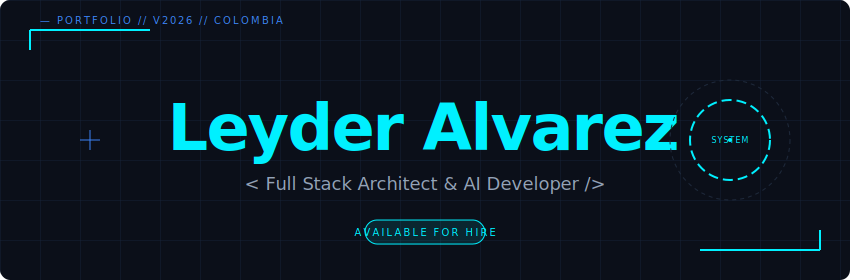
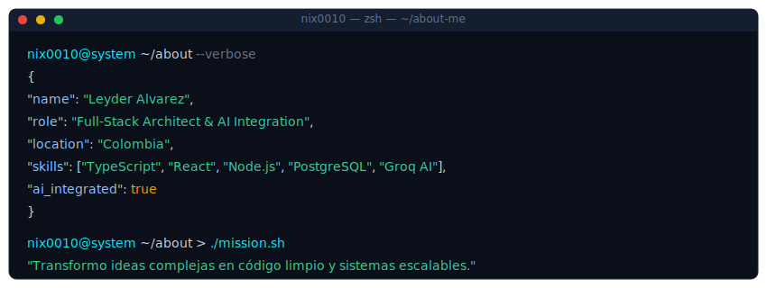

  

 

  

 

  

 

<h2 align="center" style="font-family: monospace;">// CONTRIBUTION ACTIVITY //</h2>

  <picture>
    <source media="(prefers-color-scheme: dark)" srcset="https://raw.githubusercontent.com/Nix0010/Nix0010/output/github-snake-dark.svg" />
    <source media="(prefers-color-scheme: light)" srcset="https://raw.githubusercontent.com/Nix0010/Nix0010/output/github-snake.svg" />
    
  </picture>

